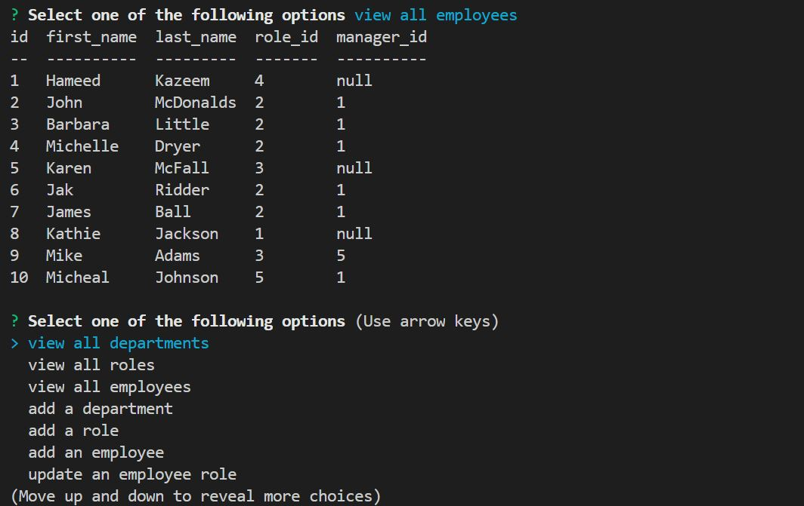
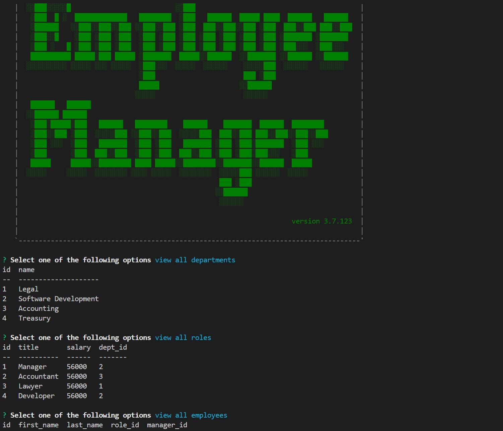

# employee-CMS

     
  ## Description
  Employee-CMS is a backend application that allows a user to create and manage employees in an organization. It uses my-sql database to store data, and Inquirer for user interaction

  ## Table of Contents
  * [Installation](#installation)
  * [Usage](#usage)
  * [License](#license)
  * [Contribution](#contribution)
  * [Test](#test)
  * [Questions](#questions)

  ## Installation
  1. Fork this repository to a local repository
  2. Install dependencies by running "npm install"
  3. Run mysql -u[username] -p
  4. Enter your mysql password
  5. Run source db/schema.sql to create the database and define the tables needed in the database
  6. Run source db/seed.sql to seed the newly created tables.
  7. Run quit to exit the mysql shell
  8. Run node index to start the application

  ## Usage
  This Application should only be used for personal projects. You may not sell this or distribute this application

  ## License
  MIT

  ## Contributing
  You can contribute to this project by creating issues on this repository

  ## Test
  Follow the instructions [here](https://drive.google.com/file/d/1eBJ8NG6Cyj18VOKAmQ9JVJ-TZlAnTn9w/view)
                                      
  
  

  ## Questions
  You can create issues on my git hub page
  [hameed1239](https://github.com/hameed1239/)
  You can also contact me via email @ hameeddecoder@gmail.com)